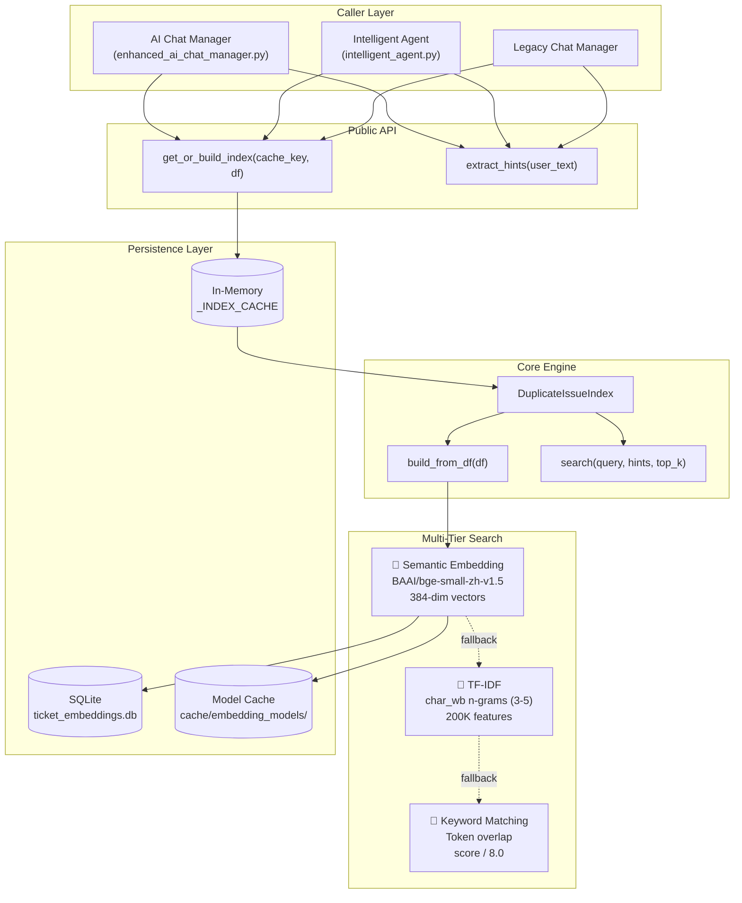
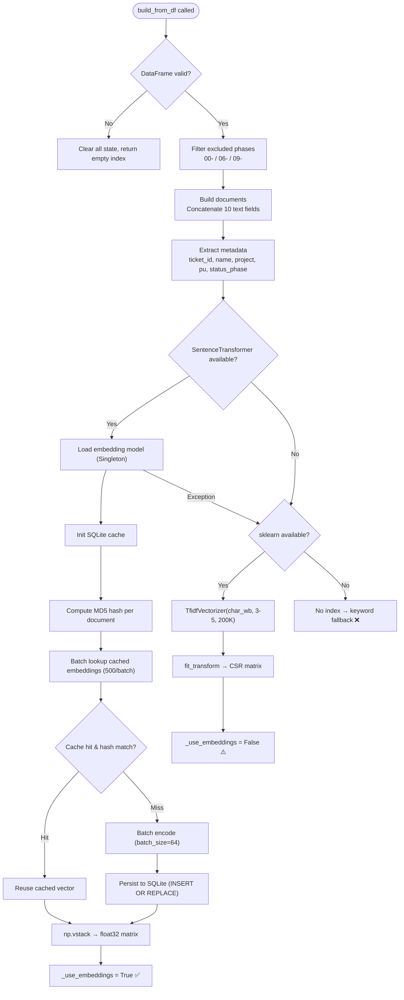
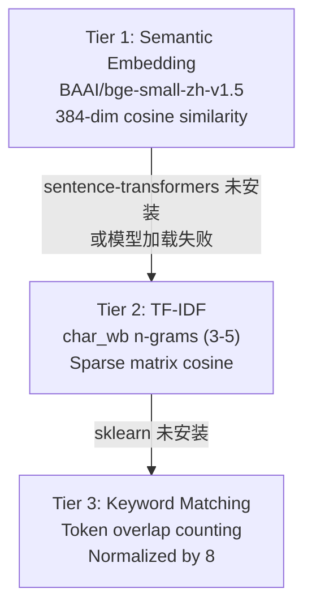
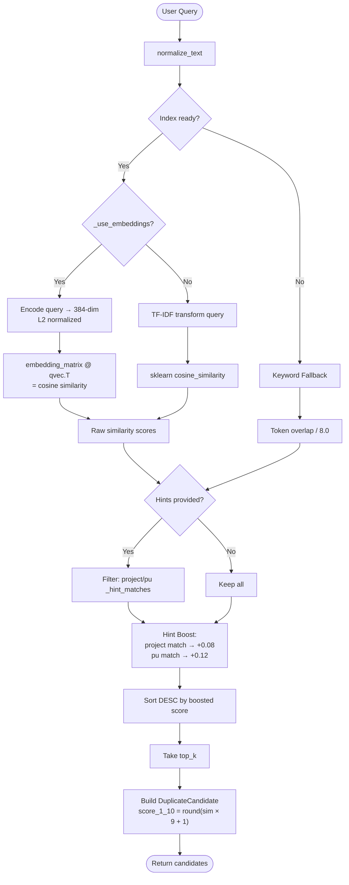
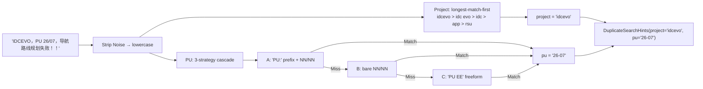
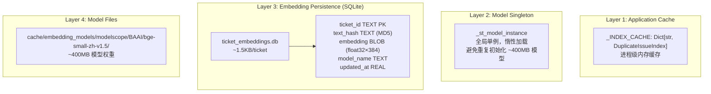

# Duplicate Issue Finder 技术架构详解

> **模块**: `duplicate_issue_finder.py` (~620 行)  
> **定位**: PreAnalysis 平台的智能重复缺陷检测引擎  
> **核心能力**: 多层次语义相似度搜索 + 结构化元数据增强 + 优雅降级

---

## 1. 系统总览

Duplicate Issue Finder 是一个**三层降级的相似度搜索引擎**，用于在数万条汽车测试缺陷记录中快速定位潜在重复项。系统设计的核心原则是：**有 GPU 用语义，无 GPU 用 TF-IDF，啥都没有用关键词——永远能工作。**



---

## 2. 核心数据结构

### 2.1 输入：DuplicateSearchHints

从用户自然语言中解析出的**结构化搜索约束**，用于缩小搜索范围并提升匹配精度。

```python
@dataclass(frozen=True)
class DuplicateSearchHints:
    project: Optional[str] = None   # 如 "idcevo", "idc", "app"
    pu: Optional[str] = None        # 如 "26-07", "ee", "hv"
```

### 2.2 输出：DuplicateCandidate

每个搜索结果封装为一个候选对象：

```python
@dataclass(frozen=True)
class DuplicateCandidate:
    score_1_10: int              # 1-10 整数评分（用于用户展示）
    similarity: float            # 0.0-1.0 原始相似度
    ticket_id: Optional[str]     # 缺陷 ID
    name: str                    # 缺陷标题
    project: Optional[str]       # 所属项目
    pu: Optional[str]            # PU 编号
    status_phase: Optional[str]  # 缺陷状态阶段
    snippet: str                 # 描述摘要（≤240 字符）
```

### 2.3 核心引擎：DuplicateIssueIndex

| 属性 | 类型 | 用途 |
|------|------|------|
| `_embedding_matrix` | `np.ndarray (N×384)` | 语义向量矩阵 |
| `_use_embeddings` | `bool` | 是否使用语义模式 |
| `_vectorizer` | `TfidfVectorizer` | TF-IDF 向量化器 |
| `_matrix` | `csr_matrix` | TF-IDF 稀疏矩阵 |
| `_meta` | `List[Dict]` | 每条缺陷的元数据 |
| `_documents` | `List[str]` | 拼接后的文档文本 |
| `_row_count` | `int` | 行数（用于缓存失效判断） |

---

## 3. 索引构建流程

### 3.1 完整流程图



### 3.2 文档构建细节

每条缺陷由 **10 个字段** 拼接为一个文档：

```python
DEFAULT_TEXT_FIELDS = (
    "name",         # 缺陷标题（最重要）
    "description",  # 详细描述
    "project",      # 项目名
    "pu",           # PU 编号
    "ecu",          # ECU 名称
    "top_aida",     # AIDA 功能域
    "fv",           # 功能变体
    "team",         # 负责团队
    "fvp",          # FVP 标识
    "lead_model",   # 主导车型
)
```

拼接策略：`"\n".join(non_empty_fields)` — 空字段自动跳过，如果全空则回退到仅使用 `name` 字段。

### 3.3 阶段过滤

构建索引时自动排除以下状态的缺陷：

| 排除前缀 | 含义 | 原因 |
|----------|------|------|
| `00-` | 刚创建/未确认 | 信息不完整 |
| `06-` | 已关闭 | 不再活跃 |
| `09-` | 已归档 | 历史数据 |

---

## 4. 三层搜索引擎详解

### 4.1 层级降级链



| 层级 | 方法 | 精度 | 查询速度 | 内存消耗 | 适用场景 |
|------|------|------|----------|----------|----------|
| **Tier 1** | Semantic Embedding | ⭐⭐⭐⭐⭐ | ~50ms | ~400MB | 生产环境（推荐） |
| **Tier 2** | TF-IDF | ⭐⭐⭐ | ~20ms | ~50MB | 无 GPU/无模型 |
| **Tier 3** | Keyword | ⭐ | ~5ms | 极少 | 紧急降级 |

### 4.2 Tier 1: Semantic Embedding（语义嵌入）

**模型**: BAAI/bge-small-zh-v1.5
- 针对中英文双语优化的通用嵌入模型
- 输出维度：384
- L2 归一化后，余弦相似度 = 向量点积

**查询时计算**:
```python
# 1. 编码查询文本 → 384 维向量
qvec = st_model.encode([query], normalize_embeddings=True)  # shape: (1, 384)

# 2. 矩阵点积 = 余弦相似度（因为已归一化）
similarities = embedding_matrix @ qvec.T  # shape: (N,)
# 复杂度: O(N × 384)，一次矩阵乘法搞定
```

**为什么选 BGE-small-zh?**
- 中文语义理解能力强（BMW 缺陷描述含大量中文）
- Small 版本仅 ~130M 参数，平衡精度与资源
- 384 维足够区分汽车测试领域的语义差异

### 4.3 Tier 2: TF-IDF（词频-逆文档频率）

```python
vectorizer = TfidfVectorizer(
    analyzer="char_wb",      # 字符级 n-gram（带单词边界）
    ngram_range=(3, 5),      # 3-5 字符子序列
    max_features=200_000,    # 词汇表上限
    lowercase=True,
)
```

**为什么用 `char_wb` 而不是 `word`?**
- 汽车领域术语（ECU 名称、错误码）往往是非标准词
- 字符 n-gram 对拼写变体（"routing" vs "routin"）有容忍度
- 跨中英文工作无需分词器

### 4.4 Tier 3: Keyword Matching（关键词匹配）

```python
# 最简单的后备方案
for token in re.findall(r"[a-z0-9_./-]{3,}", query_lower):
    if token in document_lower:
        score += 1
similarity = min(1.0, score / 8.0)  # 最多 8 个 token 就满分
```

---

## 5. 搜索流程

### 5.1 完整搜索流程



### 5.2 Hint Boost 机制

搜索结果不仅看文本相似度，还考虑**结构化元数据匹配**：

| 匹配条件 | 加分 | 效果 |
|----------|------|------|
| project 完全匹配 | +0.08 | 同项目的缺陷排名提升 |
| pu 完全匹配 | +0.12 | 同 PU 的缺陷排名更高 |
| 两者都匹配 | +0.20 | 显著提升排名 |

最终分数 clamp 到 `[0.0, 1.0]`。

### 5.3 分数转换

```python
def _to_score_1_10(similarity: float) -> int:
    return max(1, min(10, int(round(sim * 9 + 1))))
```

| 原始相似度 | 用户看到的评分 |
|-----------|--------------|
| 0.0 | 1 |
| 0.33 | 4 |
| 0.5 | 5-6 |
| 0.78 | 8 |
| 1.0 | 10 |

---

## 6. Hint 提取引擎

### 6.1 从自然语言到结构化约束



### 6.2 PU 提取三策略

| 策略 | 正则表达式 | 匹配示例 |
|------|-----------|---------|
| **A: 显式前缀** | `\bpu\s*[:：=]?\s*(\d{2})\s*[/.\-]\s*(\d{2})\b` | `PU: 26/07`, `pu：26-07` |
| **B: 裸数字对** | `\b(\d{2})\s*[/.\-]\s*(\d{2})\b` | `26/07`, `26-07`, `26.07` |
| **C: 自由标识** | `\bpu\s*[:：=]?\s*([a-z0-9...])` | `PU EE`, `pu=hv` |

### 6.3 噪声处理

```python
def _strip_noise(text: str) -> str:
    # 保留: 字母、数字、空格、/、-、.、_
    # 移除: ，、！、【】、（）、；等
    return re.sub(r"[^\w\s/.\-]", " ", text)
```

实际效果：`"IDCEVO，PU 26/07，导航路线规划失败！！"` → `"idcevo pu 26/07 导航路线规划失败"`

---

## 7. 四层缓存架构



### 缓存失效规则

| 层级 | 失效条件 | 触发时机 |
|------|---------|---------|
| **Index Cache** | `row_count` 变化 | 数据刷新后 |
| **Embedding Cache** | 文档 MD5 不匹配 | 缺陷内容被编辑 |
| **Model Singleton** | 进程重启 | 应用重启 |
| **Model Files** | 环境变量覆盖 | 手动更换模型 |

### Embedding Cache 工作原理

```
初次构建 (10K tickets):
  ├── 计算每个 document 的 MD5 hash
  ├── 查询 SQLite: 0 条命中 → 全部需要编码
  ├── SentenceTransformer.encode(10K texts, batch=64) → ~30s
  ├── 写入 SQLite (INSERT OR REPLACE)
  └── 总耗时: ~30s

增量更新 (100 条新增):
  ├── 计算 MD5 hash
  ├── 查询 SQLite: 9900 条命中 (hash 匹配)
  ├── 只编码 100 条新/变 → ~0.5s
  ├── 写入 SQLite (100 条)
  └── 总耗时: ~2-5s  ← 6倍加速
```

---

## 8. 模型加载策略

### 优先级链

```
1. 环境变量 DUPLICATE_EMBEDDING_MODEL  (手动指定路径)
        ↓ (未设置)
2. 本地缓存 cache/embedding_models/modelscope/BAAI/bge-small-zh-v1.5/
   - 检查 config.json 是否存在
   - 支持变体目录名 (bge-small-zh-v1___5)
        ↓ (未找到)
3. 远程下载 BAAI/bge-small-zh-v1.5 from HuggingFace
```

### 单例模式

```python
_st_model_instance = None  # 全局

def _get_st_model():
    global _st_model_instance
    if _st_model_instance is not None:
        return _st_model_instance    # 直接返回，避免重复加载
    
    if not SENTENCE_TRANSFORMER_AVAILABLE:
        return None                  # 库未安装，直接跳过
    
    try:
        _st_model_instance = SentenceTransformer(
            _DEFAULT_EMBEDDING_MODEL,
            cache_folder=_EMBEDDING_CACHE_DIR
        )
        return _st_model_instance
    except Exception:
        return None                  # 加载失败，返回 None → 触发 TF-IDF 降级
```

---

## 9. 集成点

### 9.1 调用方概览

```
┌─────────────────────────────────┐
│  enhanced_ai_chat_manager.py    │  ← AI 对话中的"查重复"工具
│  DuplicateIssueSearchTool       │
│  ↓                              │
│  idx = get_or_build_index(...)  │
│  hints = extract_hints(query)   │
│  candidates = idx.search(...)   │
└─────────────────────────────────┘

┌─────────────────────────────────┐
│  intelligent_agent.py           │  ← Agent 自主调用
│  Tool Registration              │
│  ↓                              │
│  from duplicate_issue_finder    │
│  import extract_hints,          │
│         get_or_build_index      │
└─────────────────────────────────┘

┌─────────────────────────────────┐
│  ai_chat_manager_legacy.py      │  ← 旧版兼容
│  Backward Compatibility         │
└─────────────────────────────────┘
```

### 9.2 典型调用序列

```python
# 1. 获取或构建索引（自动缓存管理）
idx = get_or_build_index("defects", defect_dataframe)

# 2. 从用户查询提取结构化 hints
hints = extract_hints("IDCEVO 26/07 导航路线规划失败")
# → DuplicateSearchHints(project='idcevo', pu='26-07')

# 3. 执行搜索
candidates = idx.search(
    query="导航路线规划失败",
    hints=hints,
    top_k=10
)

# 4. 使用结果
for c in candidates:
    print(f"[{c.score_1_10}/10] {c.ticket_id}: {c.name}")
    print(f"  Project: {c.project}, PU: {c.pu}, Phase: {c.status_phase}")
    print(f"  {c.snippet}")
```

---

## 10. 优雅降级设计

### 降级决策树

```
SentenceTransformer 可用?
├── ✅ → 尝试加载模型
│   ├── ✅ → 构建 Embedding Index
│   │   ├── ✅ → 使用 Semantic Search (Tier 1) ✨
│   │   └── ❌ → 降级到 TF-IDF
│   └── ❌ → 降级到 TF-IDF
└── ❌ → sklearn 可用?
    ├── ✅ → 构建 TF-IDF Index
    │   ├── ✅ → 使用 TF-IDF Search (Tier 2) ⚠️
    │   └── ❌ → 降级到 Keyword
    └── ❌ → 使用 Keyword Fallback (Tier 3) 🔴
```

### 运行时降级

即使索引构建时选择了 Tier 1，搜索时如果出现异常也会降级：

```python
def search(self, query, hints, top_k):
    try:
        if self._use_embeddings:
            sims = self._embedding_search(query)   # 可能因模型问题失败
        else:
            sims = sklearn_cosine_similarity(...)
    except Exception:
        return self._keyword_fallback(...)         # 永远有一个后备方案
```

---

## 11. 性能数据

### 基准场景: 10,000 条缺陷记录

| 操作 | 首次 | 增量 | 说明 |
|------|------|------|------|
| **索引构建 (Embedding)** | ~30s | ~2-5s | SQLite 缓存大幅加速 |
| **索引构建 (TF-IDF)** | ~3s | ~3s | 无缓存机制 |
| **单次查询 (Embedding)** | ~50ms | ~50ms | 矩阵乘法 |
| **单次查询 (TF-IDF)** | ~20ms | ~20ms | 稀疏矩阵运算 |
| **单次查询 (Keyword)** | ~5ms | ~5ms | 简单字符串匹配 |
| **内存占用 (Embedding)** | ~400MB | - | 模型权重 |
| **内存占用 (TF-IDF)** | ~50MB | - | 稀疏矩阵 |

### 关键优化手段

| 技术 | 作用 | 提升 |
|------|------|------|
| **SQLite Embedding Cache** | 避免重复编码 | 首次30s → 增量2s |
| **Batch I/O (500/batch)** | 减少 SQLite round-trip | ~10x |
| **np.vstack + float32** | 向量化矩阵运算 | ~10x vs 逐条计算 |
| **CSR 稀疏矩阵** | TF-IDF 内存压缩 | ~10-100x |
| **Singleton 模型** | 避免重复加载 400MB | 2-5s → 0s |
| **In-Memory Index Cache** | 避免重复构建索引 | 30s → 0s |

---

## 12. 安全与健壮性

### 数据安全
- SQLite 查询使用**参数化 SQL**（`?` 占位符），防止 SQL 注入
- 文件路径通过 `os.path.join` 构建，防止路径遍历

### 编码安全
```python
text.encode("utf-8", errors="replace")  # MD5 计算容忍编码错误
```

### 类型安全
```python
def _normalize_text(value: Any) -> str:
    if value is None: return ""
    if isinstance(value, float) and pd.isna(value): return ""
    return str(value).strip()
```

---

## 13. 测试覆盖

测试文件: `tests/test_duplicate_issue_finder.py`

| 测试类别 | 覆盖项 |
|---------|--------|
| **Hint 提取** | 大小写、多格式 PU、中文冒号、括号噪声、混合中英文 |
| **Project 检测** | idcevo/idc/app/rsu/空值 |
| **PU 检测** | 斜杠/横杠/点号/显式前缀/中文冒号/无 PU |
| **噪声处理** | 标点、感叹号、方括号、圆括号 |

示例测试:
```python
def test_noisy_chinese_mixed(self):
    hints = extract_hints("IDCEVO，PU 26/07，导航路线规划失败！！")
    self.assertEqual(hints.project, "idcevo")
    self.assertEqual(hints.pu, "26-07")
```

---

## 14. 配置参考

### 环境变量

| 变量 | 默认值 | 说明 |
|------|--------|------|
| `DUPLICATE_EMBEDDING_MODEL` | `BAAI/bge-small-zh-v1.5` | 覆盖嵌入模型路径 |

### 文件路径

| 文件 | 用途 |
|------|------|
| `database/ticket_embeddings.db` | Embedding 向量持久化 |
| `cache/embedding_models/` | 模型权重缓存 |

### 可调参数

| 参数 | 当前值 | 位置 | 调优建议 |
|------|--------|------|---------|
| `excluded_phase_prefixes` | `("00-", "06-", "09-")` | 构造函数 | 根据团队流程调整 |
| `text_fields` | 10 个字段 | 构造函数 | 可扩展更多字段 |
| `batch_size` (encode) | 64 | `_build_embedding_index` | GPU 可调至 128-256 |
| `max_features` (TF-IDF) | 200,000 | `build_from_df` | 数据量大可增加 |
| `ngram_range` | (3, 5) | `build_from_df` | 降低可加速但损失精度 |
| `hint_boost_project` | +0.08 | `_apply_hint_boost` | 根据业务重要性调整 |
| `hint_boost_pu` | +0.12 | `_apply_hint_boost` | PU 匹配比项目更重要 |

---

## 15. 总结：设计哲学

1. **分层降级** — 从语义到统计到关键词，永远能给出结果
2. **增量更新** — SQLite 缓存 + 内容哈希，只重算变化的部分
3. **结构增强** — 不仅看文本相似度，还利用 project/pu 等元数据提升精度
4. **懒加载** — 模型/索引按需构建，避免启动时阻塞
5. **零配置** — 开箱即用，所有依赖都是可选的

---

*文档生成日期: 2026-04-24*  
*源代码: `duplicate_issue_finder.py` (~620 行)*
