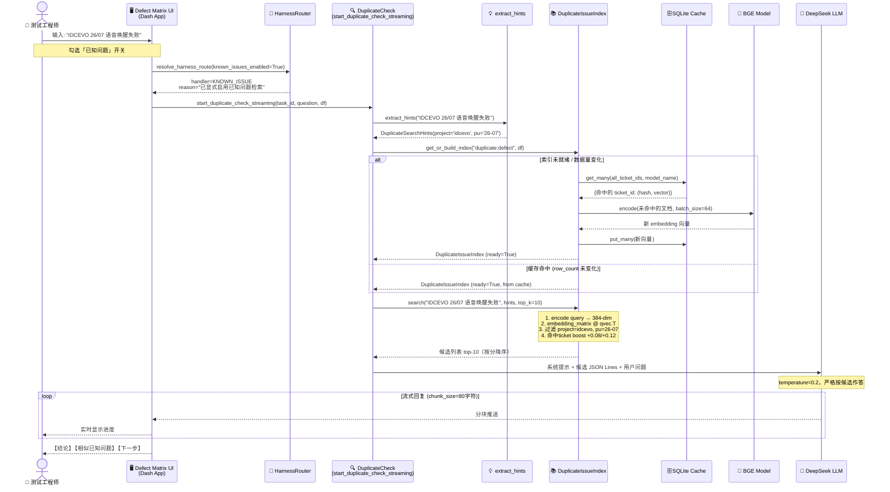
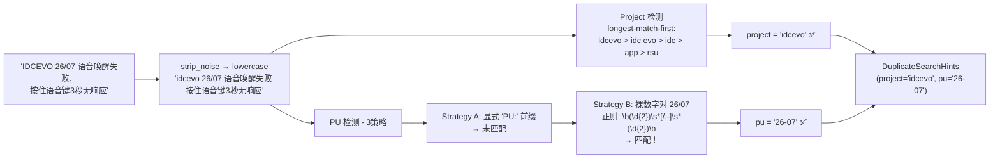
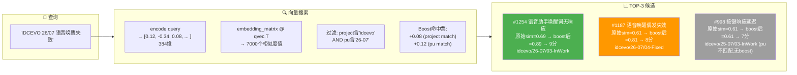
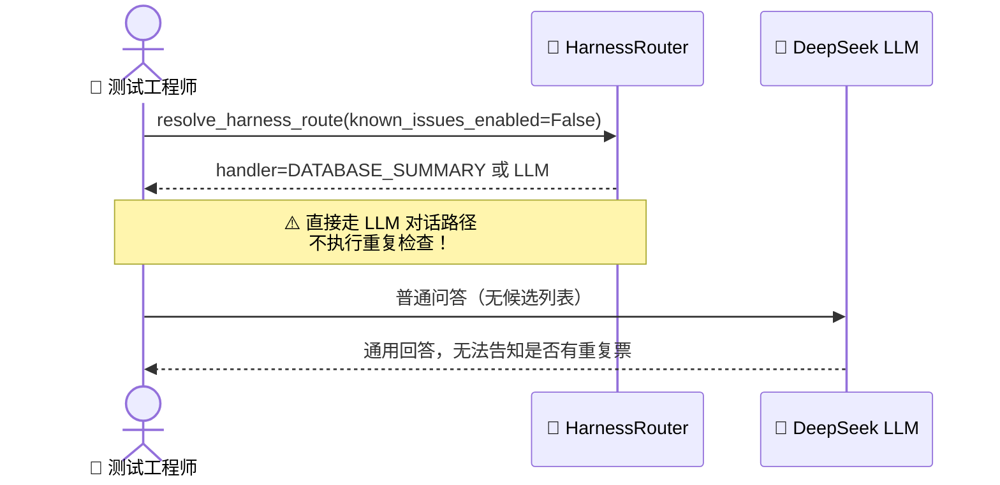
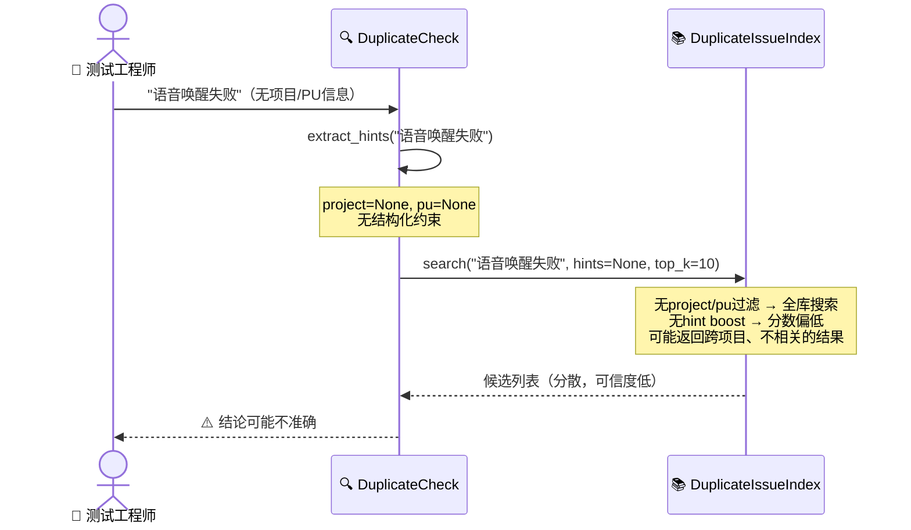
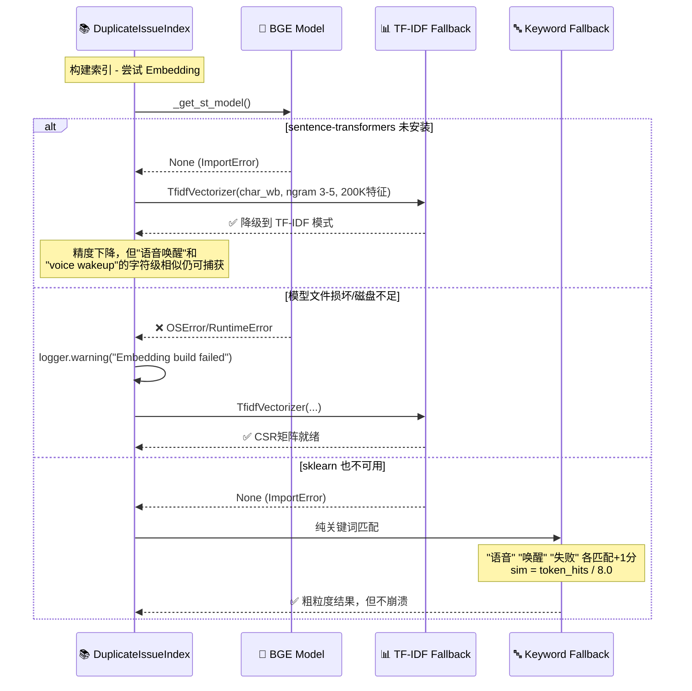
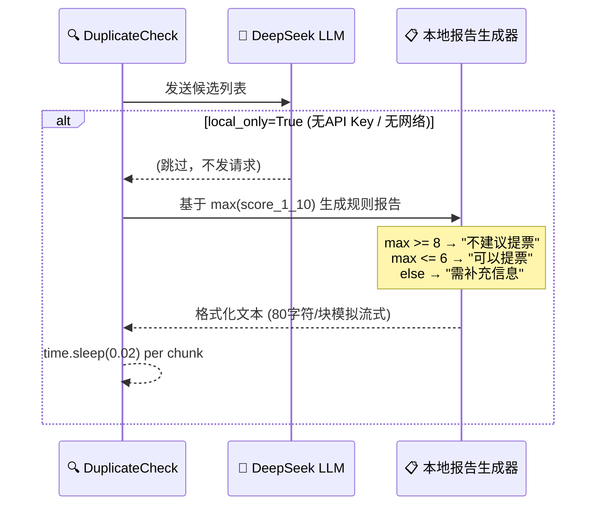

# User Journey: 重复缺陷检查 — "语音唤醒失败" 全流程

> **场景**: 测试工程师发现 IDCEVO 26/07 上语音助手按住唤醒键没有响应，怀疑这是一个已知问题，想在提票前先核查。

---

## 整体流程概览

```
用户输入
  ↓
路由决策 (HarnessRouter)
  ↓
Hint 提取 (extract_hints)
  ↓
索引构建/复用 (get_or_build_index)
  ↓
向量搜索 + Hint Boost (index.search)
  ↓
LLM 分析 或 本地生成报告
  ↓
流式推送到 UI
```

---

## Happy Path: 完整时序



---

## 关键步骤详解

### 步骤 1 — 路由决策

用户打开「已知问题」开关后，UI 调用：

```python
route_request = HarnessRouteRequest(
    question="IDCEVO 26/07 语音唤醒失败",
    selected_mode="summary",
    known_issues_enabled=True,   # ← 关键开关
    use_agent=False,
    dashboard_type="defect"
)
route_decision = resolve_harness_route(route_request, has_data=True)
# → handler=KNOWN_ISSUE, reason="已显式启用已知问题检索，优先走重复问题判定链路"
```

路由逻辑（`harness_router.py` line 169）：
```python
if request.known_issues_enabled:
    return HarnessRouteDecision(
        handler=HarnessRouteHandler.KNOWN_ISSUE,
        reason="已显式启用已知问题检索，优先走重复问题判定链路。",
        ...
    )
```

---

### 步骤 2 — Hint 提取



**实际代码执行**:
```python
hints = extract_hints("IDCEVO 26/07 语音唤醒失败，按住语音键3秒无响应")
# hints.project = "idcevo"
# hints.pu     = "26-07"
```

---

### 步骤 3 — 索引构建（含缓存机制）

系统调用 `get_or_build_index("duplicate:defect", df)`：

```
首次构建（10,000 条缺陷）:
┌─────────────────────────────────────┐
│ 1. 过滤状态: 排除 00-/06-/09- 前缀   │
│    → 保留约 7,000 条活跃缺陷          │
│                                     │
│ 2. 构建文档 (10个字段拼接):           │
│    "语音助手唤醒词无响应              │
│     ECU通信超时测试                  │
│     idcevo / 26-07 / EE             │
│     VoiceAssist / FV-NLU"           │
│                                     │
│ 3. 查询 SQLite 缓存:                 │
│    → 命中 6,950 条 (hash 匹配)       │
│    → 50 条需要重新编码               │
│                                     │
│ 4. SentenceTransformer.encode(50):  │
│    batch_size=64, ~0.3s             │
│                                     │
│ 5. 写入 SQLite + 组装矩阵            │
│    np.vstack → shape (7000, 384)    │
└─────────────────────────────────────┘
总耗时: ~2-5s (缓存已热)
```

---

### 步骤 4 — 向量搜索 + Hint Boost



**Boost 计算过程**:
```
#1254: project='idcevo' 匹配 → +0.08
       pu='26-07' 匹配     → +0.12
       最终 = 0.69 + 0.08 + 0.12 = 0.89 → score_1_10 = round(0.89×9+1) = 9

#998:  project='idcevo' 匹配 → +0.08
       pu='25-07' 不匹配   → +0.00  (pu hint='26-07' not in '25-07')
       最终 = 0.53 + 0.08 = 0.61 → score_1_10 = 7
```

---

### 步骤 5 — LLM 分析与输出

**发送给 LLM 的内容**:

```
[系统提示]
你是缺陷提票前置审查助手。规则：
- 只能基于提供的候选列表
- 相似度≥8 → 不建议提票
- 相似度≤6 → 可以提票
- 输出格式：【结论】【相似已知问题】【下一步】

候选缺陷列表（JSON Lines）：
{"score_1_10":9,"ticket_id":"1254","name":"语音助手唤醒词无响应","project":"idcevo","pu":"26-07","status_phase":"03-InWork","snippet":"按住唤醒键后系统无任何反馈，LOG显示VoiceService进程..."}
{"score_1_10":8,"ticket_id":"1187","name":"语音唤醒偶发失效","project":"idcevo","pu":"26-07","status_phase":"04-Fixed","snippet":"偶发性无法唤醒，更换固件版本后复现率降低..."}
{"score_1_10":7,"ticket_id":"998","name":"按键响应延迟","project":"idcevo","pu":"25-07","status_phase":"03-InWork","snippet":"多个功能键响应延迟300-500ms..."}

[用户问题]
IDCEVO 26/07 语音唤醒失败，按住语音键3秒无响应
```

**LLM 生成的最终输出**:

```
【结论】
- 建议：不建议提票
- 依据：发现高度相似的已知问题（9/10分），建议优先合并或追踪原票。

【相似已知问题（按相似度降序）】
- 9分：#1254 - 语音助手唤醒词无响应（idcevo/26-07，03-InWork）
  匹配点：按住唤醒键后系统无任何反馈，LOG显示VoiceService进程异常
- 8分：#1187 - 语音唤醒偶发失效（idcevo/26-07，04-Fixed）
  匹配点：偶发性无法唤醒，注意此票已关闭，可能需要重新打开
- 7分：#998 - 按键响应延迟（idcevo/25-07，03-InWork）
  匹配点：按键无响应，但PU版本不同(25-07)，相关性较低

【下一步】
- 建议合并到 #1254：在原票补充以下信息：
  1. 复现步骤（触发方式、频率）
  2. 期望行为 vs 实际行为
  3. 软件/固件版本
  4. 相关日志/截图
  5. 是否与 #1187（已关闭票）相同根因
```

---

## 异常场景

### 异常 1 — 用户没勾「已知问题」开关



**触发条件**: UI 上「已知问题」开关未开启  
**影响**: 完全跳过重复检查流程，进入普通 LLM 对话  
**解决**: 在输入问题前先勾选「已知问题」

---

### 异常 2 — 缺少 Project/PU 上下文



**典型错误输出**:
```
【结论】
- 建议：可以提票（最高相似度 6/10）
- ← ⚠️ 错误！实际上有 9/10 的重复票，但因为没有 project/pu 约束
-      导致跨项目的低分结果占据了 top-10

【相似已知问题】
- 6分：#500 - 导航语音播报问题（app/EE，与目标不同项目）
- 6分：#320 - 语音识别率下降（rsu，完全不同项目）
- ← ⚠️ 真正的重复票 #1254 因无boost而排在第15位，未出现在 top-10
```

**解决方法**: 在描述中加入项目和PU信息：  
✅ `"IDCEVO PU 26/07 语音唤醒失败"` → 自动提取 hints  
✅ `"idcevo 26-07 按住语音键无响应"` → 同样有效

---

### 异常 3 — 嵌入模型不可用（三级降级）



**各降级模式对"语音唤醒失败"的效果对比**:

| 模式 | 能匹配到 | 匹配不到 | 原因 |
|------|---------|---------|------|
| **Embedding** | "语音助手无响应"、"voice wakeup fail"、"唤醒词失效" | — | 语义理解中英文均可 |
| **TF-IDF** | "语音唤醒失败"、"语音助手唤醒" | "voice wakeup fail" | 字符n-gram，跨语言弱 |
| **Keyword** | "唤醒失败"（精确子串） | "语音助手无法激活" | 只看token是否出现 |

---

### 异常 4 — LLM API 不可用（本地降级）



**本地降级输出示例**（无 LLM 时）：

```
【结论】
- 建议：不建议提票
- 依据：与已有问题高度相似，建议优先合并/追加信息

【相似已知问题（按相似度降序）】
- 9分：#1254 - 语音助手唤醒词无响应（idcevo/26-07，03-InWork）
  匹配点：按住唤醒键后系统无任何反馈，LOG显示VoiceService进程...
- 8分：#1187 - 语音唤醒偶发失效（idcevo/26-07，04-Fixed）

【下一步】
- 建议合并到 #1254：在原票补充你的复现步骤、期望/实际、环境、日志/截图。

（提示：当前未配置可用的 LLM 密钥，因此以上为本地检索结果生成的建议。）
```

> 本地降级保证用户始终能得到结构化的查重结论，只是没有 LLM 的语义增强分析。

---

### 异常 5 — 数据为空（全部被过滤掉）

**场景**: 当前 UI 筛选条件过严，导致传入的 DataFrame 为空，或全部缺陷都处于 `06-/09-` 状态。

**输出**:
```
【结论】
- 建议：需要补充信息后再判断
- 依据：相似度中等，建议补充复现信息再决定是否新开票

【相似已知问题（按相似度降序）】
- (未检索到候选；可能当前筛选数据为空或已排除关闭态)

【下一步】
- 如果仍要提票：建议补充复现步骤、期望/实际、环境信息、日志/截图，并标注 project/PU。
```

---

## 完整决策流程图

```mermaid
flowchart TD
    START(["用户发送问题描述"]) --> ROUTE{路由判断<br/>known_issues_enabled?}
    
    ROUTE -->|"False (未勾选开关)"| NOKI["走 LLM/Agent 路径<br/>⚠️ 不执行重复检查"]
    ROUTE -->|"True (已勾选开关)"| HINTS["extract_hints(question)"]

    HINTS --> DFCHECK{当前数据是否有效?}
    DFCHECK -->|"有效"| USEDF["用 UI 传入的 DataFrame"]
    DFCHECK -->|"无效"| LOADDF["load_defect_data() 从磁盘加载"]
    LOADDF -->|"加载失败"| EMPTYDF["df = pd.DataFrame() (空)"]
    USEDF & EMPTYDF --> BUILDIDX

    BUILDIDX["get_or_build_index(cache_key, df)"] --> IDXCHECK{row_count 变化?}
    IDXCHECK -->|"No → 命中缓存"| SEARCH
    IDXCHECK -->|"Yes → 需重建"| REBUILD["build_from_df(df)"]
    REBUILD --> SEARCH["index.search(question, hints, top_k=10)"]

    SEARCH --> CANDIDATES{候选数量?}
    CANDIDATES -->|"0 条"| EMPTY_MSG["提示: 当前筛选数据为空\n或已排除关闭态"]
    CANDIDATES -->|">0 条"| LLMCHECK{LLM 可用?<br/>(API Key 存在)}

    LLMCHECK -->|"No"| LOCAL["本地规则引擎\n基于 max_score 生成报告"]
    LLMCHECK -->|"Yes"| LLMPROMPT["构建系统提示 + 候选 JSON\n发送 DeepSeek API\ntemperature=0.2"]

    LLMPROMPT & LOCAL --> STREAM["流式推送到 UI\n(80字符/块)"]
    EMPTY_MSG --> STREAM
    STREAM --> RESULT(["UI 显示最终报告\n【结论】【相似问题】【下一步】"])

    style NOKI fill:#9E9E9E,color:white
    style EMPTY_MSG fill:#FF5722,color:white
    style LOCAL fill:#FF9800,color:white
    style LLMPROMPT fill:#4CAF50,color:white
    style RESULT fill:#2196F3,color:white
```

---

## 输入质量对结果的影响

| 用户输入 | Hints 提取结果 | 搜索质量 | 建议 |
|---------|--------------|---------|------|
| `"语音唤醒失败"` | `{None, None}` | ⭐ 全库搜索，易误判 | 太简短，补充项目/PU |
| `"IDCEVO 语音唤醒失败"` | `{idcevo, None}` | ⭐⭐ project boost，pu无 | 缺 PU，结果可能跨版本 |
| `"IDCEVO 26/07 语音唤醒失败"` | `{idcevo, 26-07}` | ⭐⭐⭐⭐⭐ 双重boost | **推荐输入格式** |
| `"IDCEVO，PU：26/07，语音唤醒失败"` | `{idcevo, 26-07}` | ⭐⭐⭐⭐⭐ | 中文冒号也支持 |
| `"[IDCEVO] (26/07) voice wakeup 无响应"` | `{idcevo, 26-07}` | ⭐⭐⭐⭐⭐ | 括号噪声自动过滤 |

---

## 技术关键数值汇总

| 参数 | 值 | 说明 |
|------|-----|------|
| 排除阶段前缀 | `00- / 06- / 09-` | 过滤未确认/关闭/归档 |
| 索引文档字段 | 10个 | name+description+project+pu+ecu+... |
| 嵌入维度 | 384 | BGE-small-zh-v1.5 输出 |
| 编码批量 | 64 | SentenceTransformer batch_size |
| SQLite批量读写 | 500 | 减少 round-trip |
| Project Boost | +0.08 | 结构化元数据加分 |
| PU Boost | +0.12 | 比 project 更细粒度，权重更高 |
| LLM Temperature | 0.2 | 保证输出稳定性 |
| 流式块大小 | 80字符 | 模拟打字机效果 |
| 不建议提票阈值 | score ≥ 8 | 对应 similarity ≥ ~0.78 |
| 可以提票阈值 | score ≤ 6 | 对应 similarity ≤ ~0.56 |

---

*User Journey 生成日期: 2026-04-24*  
*对应源码: `duplicate_issue_finder.py` + `agent/core/enhanced_ai_chat_manager.py` + `agent/core/harness_router.py`*
